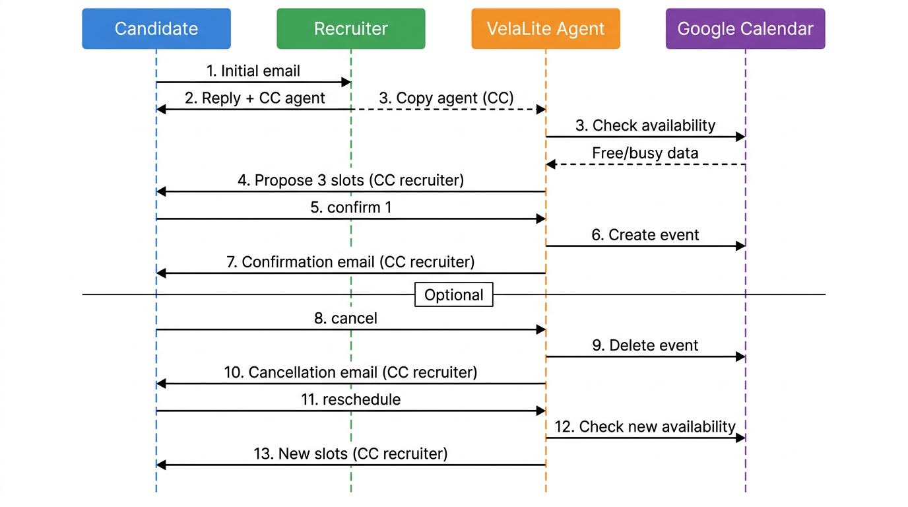

# VelaLite

AI interview scheduling over email.

VelaLite acts as an AI assistant inside email threads and automatically coordinates interview scheduling between recruiters and candidates. It reads email conversations, checks calendar availability, proposes interview slots, and schedules meetings once a time is confirmed.

All coordination happens directly inside the email thread.

## Recruiter Quick Start


### 1. CC the VelaLite agent once

When a candidate first contacts the recruiter, the recruiter replies and adds the VelaLite agent in CC.

Example email:

- **From:** `recruiter@company.com`
- **To:** `candidate@gmail.com`
- **CC:** `velalite.agent@gmail.com`

After this first reply, the agent joins the email thread and continues handling scheduling.  
The recruiter does not need to manually manage scheduling messages after that.

The agent will communicate with the candidate and keep the recruiter in CC.

### 2. Connect your Google Calendar once

VelaLite uses OAuth to access the recruiter's calendar securely.

On the VelaLite landing page, click the **“Connect Google Calendar”** button. When you click it:

1. Google will ask which account to use (choose your recruiter Gmail).
2. You grant access to calendar availability and events.
3. VelaLite stores a token so it can read your free/busy times and create interview events on your behalf.

You only need to do this once per recruiter account.

### 3. How the agent understands candidate replies

Candidates do not need to use strict commands.

VelaLite uses AI to understand natural language replies such as:

- "Wednesday works for me"
- "Can we do another slot?"
- "Let's reschedule for tomorrow"
- "Please cancel this meeting"

The system detects intent from email text and performs the correct action automatically.

### 4. End to end behavior

1. Candidate sends an email to the recruiter.
2. Recruiter replies once and CCs the VelaLite agent.
3. The agent checks the recruiter's calendar and proposes available interview slots.
4. The candidate replies with their preferred time.
5. The agent creates or updates the calendar event and sends confirmation to both participants.

All communication continues within the same email thread.

## Scheduling Flow



## Known Limitation

- With OAuth connected, VelaLite creates events directly on the recruiter&apos;s calendar and Google Calendar sends the official invite card to the candidate.
- If a recruiter has **not** connected their calendar, the system falls back to a shared service-account calendar and sends plain-text confirmation emails instead of Google invite cards.

## Local Setup 

Use this section only if you want to run VelaLite locally.

### Install dependencies

```bash
npm install
```

### Database setup

Set the database connection string in `.env`.

```env
DATABASE_URL=...
```

Run the Prisma migration.

```bash
npx prisma migrate dev
```

### Environment variables

Create a `.env` file and provide:

```env
DATABASE_URL=...

ASSISTANT_EMAIL=your.agent@gmail.com

GMAIL_CLIENT_ID=...
GMAIL_CLIENT_SECRET=...
GMAIL_REDIRECT_URI=https://developers.google.com/oauthplayground
GMAIL_REFRESH_TOKEN=...

GROQ_API_KEY=...

GOOGLE_APPLICATION_CREDENTIALS=keys/your-service-account-key.json
```

### Run the application

Start the development server:

```bash
npm run dev
```

Start the Gmail poller:

```bash
npm run gmail:poll
```

Optional custom polling interval:

```bash
GMAIL_POLL_INTERVAL_MS=60000 npm run gmail:poll
```

## MCP Calendar Tools (Advanced)

Optional MCP interface for external AI tool access.

If you use an MCP-compatible client (like Claude Desktop or modern AI IDEs), you can talk to your calendar through VelaLite as tools:

- **check_availability**: returns upcoming free interview slots on a recruiter calendar.
- **schedule_interview**: creates an interview event on the recruiter calendar and invites the candidate.
- **cancel_interview**: cancels a previously scheduled interview event.

To run the MCP server locally:

```bash
npm run mcp:server
```

Developed by **Prince Jain**

